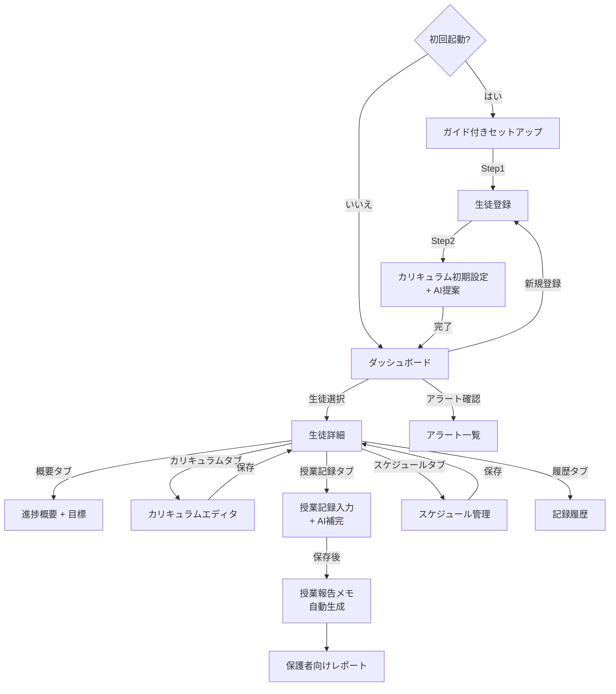

# 画面フロー & ユーザーストーリー v2.0

---

## 1. ペルソナ定義

このアプリは以下の3タイプの講師を想定して設計します。

### ペルソナ A: 新人講師

| 項目 | 内容 |
|------|------|
| 状況 | 塾に入ったばかり、担当生徒1〜3名 |
| 最大の悩み | 「何を、どの順番で教えればいいかわからない」 |
| 求める体験 | AIがカリキュラムを提案してくれる。保護者への報告テンプレートがある |
| 技術レベル | スマホは使えるがPCの業務ツールは不慣れ |

### ペルソナ B: 事務嫌い講師

| 項目 | 内容 |
|------|------|
| 状況 | 経験豊富、担当生徒5〜10名 |
| 最大の悩み | 「教えるのは好きだが事務作業が苦痛」 |
| 求める体験 | 毎回の記録は3分以内。必須入力だけで済む。レポートは自動生成 |
| 技術レベル | PC操作は問題ないが、複雑なツールは避けたい |

### ペルソナ C: AI活用型講師

| 項目 | 内容 |
|------|------|
| 状況 | データに基づく指導に関心あり |
| 最大の悩み | 「経験と勘だけでなく、データで判断したい」 |
| 求める体験 | 予想点数、復習タイミング予測、傾向分析がAIで得られる |
| 技術レベル | 新しいツールに抵抗がない |

---

## 2. 画面フロー

### 2.1 全体フロー



### 2.2 初回ユーザーの導線（重要）

初めて使う講師は以下の順で進む:

```
1. 生徒を登録（必須4項目: ID, 学校種別, 学年, 科目）
   ↓
2. AIがカリキュラムを提案 → 確認して採用
   ↓
3. ダッシュボードに生徒カードが表示される
   ↓
4. 授業後に記録を入力（3〜5分）
```

---

## 3. ユーザーストーリー

各ストーリーには以下のラベルを付与します:

- `[必須]` — アプリの基本機能。これがないと使えない
- `[推奨]` — あると便利だが、なくても最低限は使える
- `[発展]` — データが蓄積された後に価値が出る高度な機能

---

### 3.1 初回セットアップ・オンボーディング

> 対象ペルソナ: **新人講師**

**US-01** `[必須]` Phase B
**講師**として、初めてでも迷わないステップ形式のセットアップがほしい。
なぜなら、画面を開いた瞬間に何をすればいいかわからないと使うのをやめてしまうから。
- 受け入れ基準: 最初の生徒登録が10分以内に完了する

**US-02** `[必須]` Phase B
**新人講師**として、学年と科目を選ぶだけでAIが標準カリキュラム（単元リスト）を提案してほしい。
なぜなら、何を教えるべきか自分では判断できないから。
- 受け入れ基準: AI提案が2秒以内に表示される。信頼度インジケーター付き

**US-03** `[推奨]` Phase B
**新人講師**として、目標タイプ（定期テスト・受験等）を選ぶと目標期日をAIが提案してほしい。
なぜなら、テスト日程を自分で調べるのは手間だから。
- 受け入れ基準: 学年と目標タイプから一般的な試験時期を提案

---

### 3.2 生徒管理

> 対象ペルソナ: **全員**

**US-04** `[必須]` Phase A ✅ 実装済み
**講師**として、必須4項目（ID, 学校種別, 学年, 科目）だけで生徒を登録したい。
なぜなら、まず始められることが大事だから。
- 受け入れ基準: 必須項目のみで3分以内に登録完了。任意項目は明確に区別

**US-05** `[必須]` Phase A ✅ 実装済み
**講師**として、ダッシュボードで全生徒を一覧し、進捗とアラートを一目で把握したい。
なぜなら、毎回生徒を1人ずつ開いて確認するのは非効率だから。
- 受け入れ基準: ダッシュボード表示が1秒以内。進捗バーとアラートバッジ付き

**US-06** `[推奨]` Phase A ✅ 実装済み
**講師**として、1人の生徒に複数の目標（定期テスト + 受験など）を設定したい。
なぜなら、異なる目標ごとに進捗を追いたいから。
- 受け入れ基準: 目標の追加/編集/削除がダイアログで操作可能

---

### 3.3 カリキュラム管理

> 対象ペルソナ: **新人講師** / **AI活用型講師**

**US-07** `[必須]` Phase B
**新人講師**として、AIが提案した単元リストに信頼度（高/中/低）が表示されてほしい。
なぜなら、どの提案を信じてよいか判断材料がほしいから。
- 受け入れ基準: 各AI提案に信頼度アイコン表示。未確認の提案は点線枠で表示

**US-08** `[必須]` Phase A ✅ 実装済み
**講師**として、ドラッグ＆ドロップで単元の順番を変えたい。
なぜなら、生徒ごとに教える順番を柔軟に調整したいから。
- 受け入れ基準: 並べ替えがIndexedDBに即座に反映される

**US-09** `[推奨]` Phase C
**講師**として、各単元に重み（配点比率）を設定したい。
なぜなら、予想点数の計算でテスト配点を反映させたいから。
- 受け入れ基準: Unit.weight フィールドで設定可能

**US-10** `[発展]` Phase D
**AI活用型講師**として、AIが生徒の学習ペースに基づいて想定コマ数を自動調整してほしい。
なぜなら、計画の精度が上がれば指導の質も上がるから。
- 受け入れ基準: 5回以上の授業記録後にハイブリッドアプローチで補正

---

### 3.4 授業記録（日次）

> 対象ペルソナ: **事務嫌い講師**

**US-11** `[必須]` Phase B
**事務嫌い講師**として、授業後5分以内・10クリック以内で記録を完了したい。
なぜなら、記録に時間がかかると続かないから。
- 受け入れ基準: 実施単元選択 + 理解度(1-5) + 保存の最短パスが5分以内。AIが予定単元を事前選択

**US-12** `[推奨]` Phase C
**事務嫌い講師**として、理解度を入力したらAIがコメントを提案してほしい。
なぜなら、毎回文章を考えるのが面倒だから。
- 受け入れ基準: 理解度入力後2秒以内にコメント候補が表示される

**US-13** `[推奨]` Phase B
**講師**として、次回の授業で教えるべき単元をAIが提案してほしい。
なぜなら、カリキュラムを毎回見返す手間を省きたいから。
- 受け入れ基準: カリキュラム順序 + 完了状態から次の単元を自動提案

**US-14** `[発展]` Phase D
**AI活用型講師**として、入力に矛盾がある場合（前回理解度5→今回2など）AIが確認を求めてほしい。
なぜなら、文脈を正確に記録しておきたいから。
- 受け入れ基準: AI質問モーダルが表示される（優先度別: 赤=必須回答 / 黄=推奨 / 青=スキップ可）

---

### 3.5 保護者コミュニケーション

> 対象ペルソナ: **新人講師**

**US-15** `[必須]` Phase C
**新人講師**として、授業記録から保護者向けの報告メモをAIに自動生成してほしい。
なぜなら、保護者への文面をゼロから考えるのは大きな負担だから。
- 受け入れ基準: 授業記録保存後にワンクリックで報告メモ生成。講師が確認・編集してから確定

**US-16** `[推奨]` Phase D
**講師**として、生徒の進捗をまとめた定期レポート（PDF）を生成したい。
なぜなら、保護者面談や報告書提出に使えるから。
- 受け入れ基準: 進捗率、単元別ステータス、予想点数を含むPDF出力

**US-17** `[発展]` Phase D
**新人講師**として、生徒の状況に合わせてAIが報告のトーンを調整してほしい。
なぜなら、成績が伸びている子と苦戦している子で伝え方を変えたいから。
- 受け入れ基準: コンテキストに応じた表現調整（前向き / 注意喚起 / 励まし）

---

### 3.6 スケジュール管理

> 対象ペルソナ: **事務嫌い講師**

**US-18** `[必須]` Phase B
**講師**として、生徒の通常授業日と時間帯を設定したい。
なぜなら、ダッシュボードで「今日の授業」を表示するために必要だから。
- 受け入れ基準: 曜日 + 時間帯の設定が1分以内

**US-19** `[必須]` Phase B
**講師**として、振替・休講を2分以内で登録したい。
なぜなら、スケジュール変更は頻繁に起きるが手間をかけたくないから。
- 受け入れ基準: 振替フォーム入力が2分以内

**US-20** `[推奨]` Phase C
**事務嫌い講師**として、祝日が自動表示されスケジュール競合を警告してほしい。
なぜなら、祝日を見落として生徒を待たせたことがあるから。
- 受け入れ基準: 日本の祝日データが自動読み込み。競合時にアラート表示

**US-21** `[推奨]` Phase C
**講師**として、残り単元数と進捗ペースからAIが季節講習の回数を提案してほしい。
なぜなら、夏期・冬期講習の計画を毎回悩みたくないから。
- 受け入れ基準: 残り単元 ÷ 1回あたり消化数から推奨回数を算出

---

### 3.7 復習・アラート

> 対象ペルソナ: **全員**

**US-22** `[必須]` Phase C
**講師**として、進捗が計画より遅れている場合にアラートで知らせてほしい。
なぜなら、気づかないまま目標期日を迎えたくないから。
- 受け入れ基準: 1週間遅延=黄色、2週間遅延=赤。ダッシュボードに表示

**US-23** `[推奨]` Phase C
**講師**として、完了単元が一定期間経過したら「要復習」に自動変更してほしい。
なぜなら、忘却曲線の効果を手動で管理するのは現実的でないから。
- 受け入れ基準: ステータスが「完了」→「要復習」に自動遷移（設定期間経過後）

**US-24** `[発展]` Phase D
**AI活用型講師**として、この生徒の定着パターンからどの単元が忘れられやすいかAIに予測してほしい。
なぜなら、事前に復習すれば効率が良いから。
- 受け入れ基準: 過去データのパターンから復習リスクを予測（5回以上の記録が必要）

---

### 3.8 データ・プライバシー

> 対象ペルソナ: **全員**

**US-25** `[必須]` Phase A ✅ 実装済み
**講師**として、全データがブラウザ内に保存され、外部サーバーに送信されないことを保証してほしい。
なぜなら、生徒の個人情報を守る責任があるから。
- 受け入れ基準: データはDexie.js（IndexedDB）のみ。外部API通信なし

**US-26** `[必須]` Phase D
**講師**として、全データをJSONでエクスポート/インポートしたい。
なぜなら、ブラウザのデータが消えた場合に復旧できる手段が必要だから。
- 受け入れ基準: エクスポート→インポートで全データが完全に復元される

**US-27** `[推奨]` Phase D
**講師**として、AI学習データだけを独立してリセットしたい。
なぜなら、AIの提案精度がおかしくなった場合に入力履歴を失わずに直したいから。
- 受け入れ基準: コンテキストリセット機能。授業記録は保持される

---

### 3.9 最小入力ガイド

> 対象ペルソナ: **事務嫌い講師**

**US-28** `[必須]` Phase B
**事務嫌い講師**として、すべてのフォームで「必須」と「任意」が明確に区別されてほしい。
なぜなら、最低限だけ入力して早く終わらせたいから。
- 受け入れ基準: 必須項目にマーカー表示。任意項目は折りたたみまたは非表示がデフォルト

---

## 4. 入力時間の目安

入力項目一覧に基づく、講師に求める時間投資の一覧です。

| タイミング | 頻度 | 入力内容 | 目標時間 | AI補完 |
|-----------|------|---------|---------|--------|
| 初回セットアップ（生徒ごと） | 1回 | 基本情報, 目標, 科目, 単元リスト | 15〜30分 | AI提案で10分に短縮 |
| 毎回の授業後 | 毎授業 | 実施単元, 理解度, コメント | 3〜5分 | AI事前選択 + コメント提案 |
| スケジュール変更 | 随時 | 振替/休講 | 1〜2分 | — |
| 季節講習計画 | 年2〜3回 | 期間, 回数, 日程 | 5〜10分 | AI回数提案 |
| テスト結果入力 | 年4〜6回 | 点数, 範囲 | 2〜3分 | — |
| 月次レビュー | 月1回 | 目標/進捗の見直し | 5〜10分 | AI変更提案 |

---

## 5. AI補完機能のUX仕様

### 5.1 表示の区別

AIが補完した値とユーザーが入力した値は、見た目で区別します。

| 状態 | 表示 | 意味 |
|------|------|------|
| ユーザー入力 | 通常表示（実線枠） | 講師が直接入力した値 |
| AI提案（未確認） | 点線枠 + ✨アイコン | AIが提案したが講師が未確認 |
| AI提案（確認済） | 実線枠 + 小さい✨ | AIが提案し講師が承認した |
| AI提案（低信頼度） | 点線枠 + ⚠️アイコン | AIの確信度が低い。確認推奨 |

### 5.2 信頼度インジケーター

| レベル | 表示 | 意味 |
|-------|------|------|
| 高（80%以上） | ●●● | 教育課程基準に基づく提案。そのまま採用可 |
| 中（50〜80%） | ●●○ | 過去データに基づくがばらつきあり。確認推奨 |
| 低（50%未満） | ●○○ | 判断材料が少ない。講師の判断が必要 |

### 5.3 AI質問システム

AIが判断に迷った場合、講師に確認を求めます。

| 優先度 | 表示 | 対応 | 例 |
|-------|------|------|-----|
| 🔴 高 | モーダル表示 | 回答必須 | 「完了にしますか？過去の傾向では復習が必要です」 |
| 🟡 中 | 入力欄の下に表示 | 回答推奨 | 「想定3コマですが、この生徒は2コマで終わるかも。変更しますか？」 |
| 🔵 低 | 小さい通知 | スキップ可 | 「目標点数が未設定です。予測に使いますか？」 |

### 5.4 ハイブリッドアプローチ

AIは「一般的な教育データ」と「この生徒の過去データ」を組み合わせて提案します。

| データ蓄積量 | 一般データの重み | 過去データの重み | 方針 |
|-------------|---------------|---------------|------|
| 新規（0件） | 100% | 0% | 教育課程基準のみで提案 |
| 少量（1〜5件） | 70% | 30% | 一般基準ベース + 微調整 |
| 中程度（6〜15件） | 40% | 60% | 生徒データ優先 |
| 十分（16件以上） | 20% | 80% | ほぼ生徒固有の予測 |

---

## 6. 開発フェーズ対応表

| Phase | テーマ | ストーリー |
|-------|-------|-----------|
| **A（完了）** | 基盤 + 生徒詳細 | US-04, US-05, US-06, US-08, US-25 |
| **B（次）** | 授業記録 + スケジュール + AI基礎 | US-01, US-02, US-03, US-07, US-11, US-13, US-18, US-19, US-28 |
| **C** | 進捗追跡 + アラート + 保護者報告 | US-09, US-12, US-15, US-20, US-21, US-22, US-23 |
| **D** | データ管理 + 高度AI | US-10, US-14, US-16, US-17, US-24, US-26, US-27 |

---

## 7. UIコンポーネント一覧

### 実装済み（Phase A）
- **StudentCard** — ダッシュボード上の生徒カード（進捗バー付き）
- **StudentSummaryCard** — 生徒詳細の概要カード
- **GoalEditor** — 目標の追加/編集/削除ダイアログ
- **CurriculumEditor** — ドラッグ＆ドロップ単元リスト + ステータス変更
- **ProgressBar** — カリキュラム完了率の可視化

### Phase B で必要
- **OnboardingWizard** — 初回セットアップのステップ形式ガイド
- **ClassRecordForm** — 授業記録クイック入力フォーム（AI事前選択付き）
- **ScheduleSettings** — 授業曜日・時間帯の設定
- **RequiredFieldMarker** — 必須/任意の視覚的区別

### Phase C で必要
- **AIConfidenceBadge** — AI提案の信頼度表示（●●●/●●○/●○○）
- **AIQuestionModal** — AI確認プロンプト（優先度別）
- **AlertBanner** — ダッシュボード上部のアラート通知
- **ParentReportGenerator** — 授業報告メモの自動生成 + 編集画面
- **CalendarView** — スケジュール表示（祝日・振替含む）

### Phase D で必要
- **DataExportImport** — JSON一括エクスポート/インポート
- **PDFReportViewer** — 保護者向けPDFレポートのプレビュー

---

## 8. 変更履歴

| バージョン | 日付 | 変更内容 |
|-----------|------|---------|
| v1.0 | 2026-01 | 初版作成（英語、5カテゴリ9ストーリー） |
| v2.0 | 2026-02 | 全面改訂: ペルソナ定義追加、28ストーリーに拡充、画面フロー再設計、AI UX仕様追加、日本語化 |
