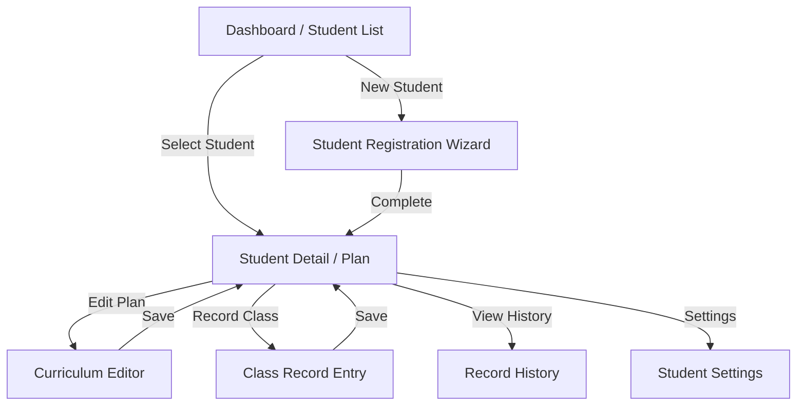

# Screen Flow & User Stories

## 1. Screen Flow (Mermaid)

## 2. User Stories

### Core Features
1. **Student Management**
   - As a Tutor, I want to register a new student with their grade and subjects so that I can start planning.
   - As a Tutor, I want to see a list of my students to quickly access their plans.

2. **Curriculum Planning**
   - As a Tutor, I want to see a suggested list of units based on the student's grade (AI Auto-fill) so I don't have to type everything manually.
   - As a Tutor, I want to drag and drop units to reorder them to fit the student's specific needs.
   - As a Tutor, I want to set a target date for an exam and have the system calculate if we are on track.

3. **Daily Class Management**
   - As a Tutor, I want to easily record today's class progress (what units we did) with a few clicks.
   - As a Tutor, I want to rate the student's understanding (1-5) to track their mastery over time.
   - As a Tutor, I want the system to suggest the next unit to teach based on our progress.

4. **Review & Alerts**
   - As a Tutor, I want to be alerted if a student is falling behind schedule so I can adjust the plan or talk to parents.
   - As a Tutor, I want the system to flag units that need review based on the "Forgetting Curve" logic.

5. **Data & Privacy**
   - As a Tutor, I want to export all data to a JSON file to backup or transfer to another device.
   - As a Tutor, I want to be sure that student names are not sent to any external server (Local-first).

## 3. UI Components needed
- **StudentCard**: Displays summary info.
- **KanbanBoard / List**: For Unit status (Not Started -> Done).
- **ProgressBar**: Visualizing curriculum completion.
- **CalendarView**: For schedule adjustments.
